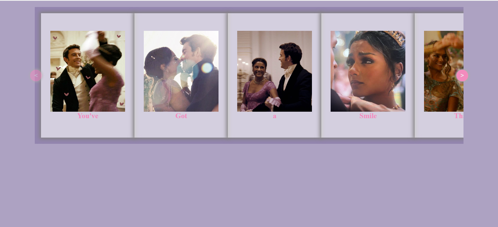
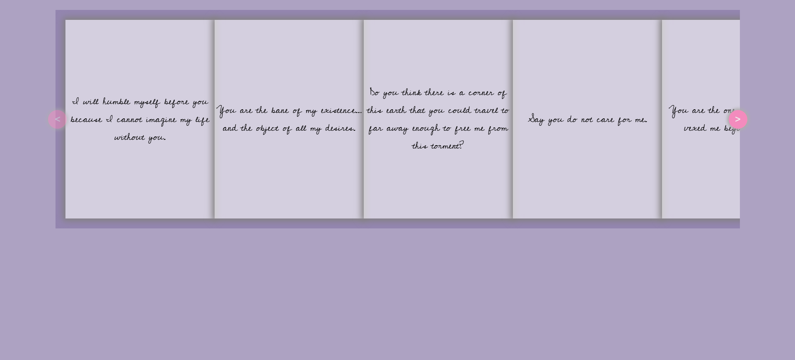

Hey guys! If you're following through this project; I wanna make it even easier for you. I'll be explaining each line of the `index.html` file in brief here, so it is convenient for you to refer to this documentation while you code.

The two main components for this project are:
- Building the Carousel
- Building the Polaroid Card

Therefore, the structure for the HTML file is pretty simple.

```
<div class="carousel">
        <div class="card-container">
            <div class="card">
                <div class="front">
                    
                    <h3>You've</h3>
                </div>
                <div class="back">
                    <p>I will humble myself before you because I cannot imagine my life without you.</p>
                </div>
            </div>
        </div>
</div>
```
- `.carousel` div is used to create the carousel which will contain all of our Polaroid cards and make then scrollable.
- `.card-container` div is used to create a container for the cards and is neccessary because we want to apply `perspective` property to the card so that the flipping animation appears more 3D, rather than flat.
- `.card` div is used to create our actual Polaroid Card.
- `.front` div is used to create the front-side of the card. This is rendered in 3D space when we use `transform-style: preserve-3d` on the `.card` so that the flip appears more real.
- `.back` div is used to create the back-side of the card. This is also rendered in 3D space as all children of the element with the property of `transform-style: preserve-3d` are rendered in 3D space. In our case, `.front` & `.back` are both children of `.card` and this is done to make the card flip appear more real.

- `.front` consists of an `img` tag, because Polaroids have pictures. It also has a `h3` element for writing some text.
- `.back` consists of a `p` tag to write some warm messages.
 
  To add more cards, all you need to do it copy paste the entire `.card-container` equal to how many cards you want, inside your `.carousel` div. I wanted twelve of them, so in my code, I have replicated it twelve times.

> [!NOTE]
> I'm fully aware that this is not the best way to write your code. But, the goal here was to make a project using only HTML & CSS. Dynamic card creation and rendering was not the goal of this project. This is for beginers just getting into web-dev wanting to build something aesthetic and learn. My beloved pro developers can always spice up their own codes.

> [!CAUTION]
>  Do not replicate the entire `.carousel` multiple times. You would end up creating multiple carousels which is not what we want. Check the indentations and closing tags for the div's and use `Format Document` to auto format if using VS Code.

> [!IMPORTANT]
> Do not replicate `.card` inside one single `.card-container`. This would make all the cards flip at once even if you are trying to flip only one card. This is because we have applied the `:hover` property over the `.card-container` and then rotated the card. Replicating multiple cards inside the same card-container gets all the cards flipped because you are hovering over that single container anyways. You can also do `.card:hover` and rotate the card, but it would make the flip appear choppy as you are hovering over the card as well as trying to rotate it. The cleaner structure would be to have separate `.card-container` replicated depending upon how many cards are required.


 Here you can see what happens if you replicate multiple `.cards` within the same `.card-container`:

 
 The cards go vertically downwards because the `.card-container` is not a flexbox.

 We can change it by doing `display:flex`:
 

 You see, the cards shrink. Let's increase the width of the card-container by `flex: 0 0 180em`:
 

 And let's see, if I hover over the second card:
 
 You can see all the cards get flipped.\
 It is hard to show a choppy flip in an image, but if you want, you can go ahead and try it on your own by doing `.card:hover` instead of `.card-container: hover .card` in your stylesheet.


 That's all the concepts for this `index.html`.

 If need some help with the CSS: [02_Decoding_style.css.md](02_Decoding_style.css.md)\
 Need an Electron Tutorial: [03_Desktop_Widget_using_Electron.md](03_Desktop_Widget_using_Electron.md)\
 Need to clarify concepts: [Watch My YouTube Video]()
